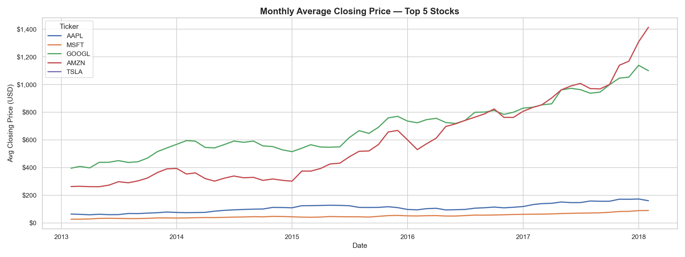
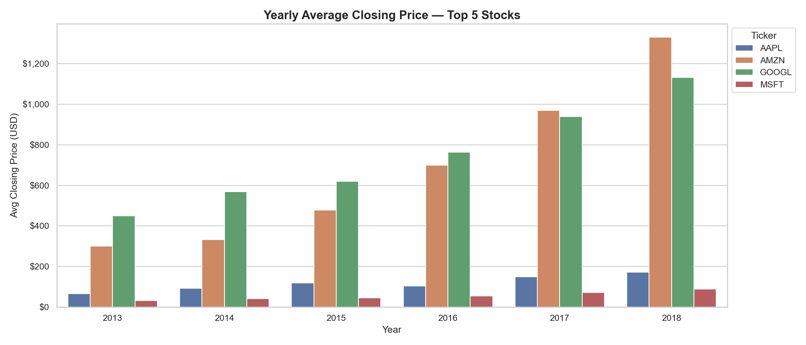
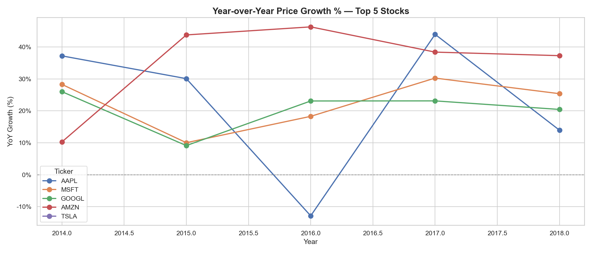
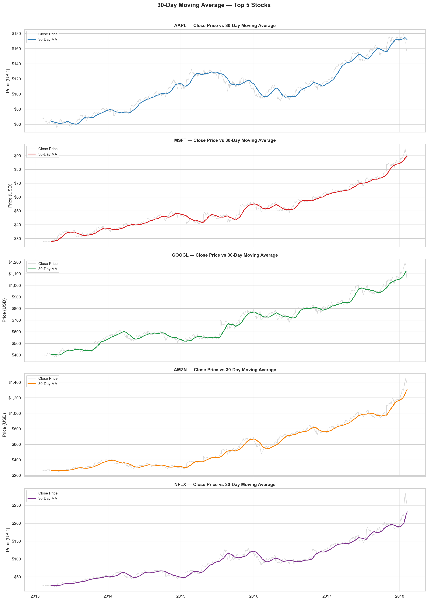
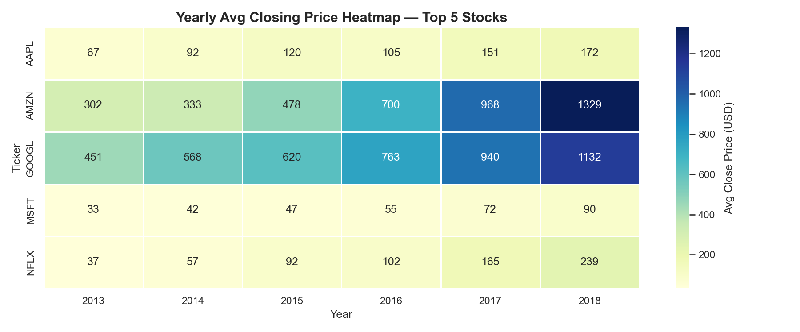

# 📈 Stock Market Performance Analysis — S&P 500

## 📌 Project Overview

This project performs an end-to-end stock market analysis on **600,000+ rows** of historical S&P 500 data covering **484 companies** across **11 sectors** from **2013 to 2018**.

The analysis is structured across **6 modules** using **MySQL** for data extraction and querying, and **Python** (pandas, matplotlib, seaborn) for visualisation — transforming raw trading data into clear, business-relevant insights.

---

## 🎯 Objectives

- Analyse price trends and monthly/yearly movements of top stocks
- Identify top and bottom performing stocks over a 5-year period
- Measure stock volatility using standard deviation and daily return metrics
- Detect unusual trading volume spikes and bullish market signals
- Compare sector-level performance across price, risk, and volume dimensions

---

## 📂 Project Structure

```
stock-market-analysis/
│
├── data/
│   ├── Stocks .csv               # Raw S&P 500 historical stock data
│   └── companies.csv            # Company metadata (sector, industry)
│
├── sql/
│   ├── 1_exploration.sql       # Data exploration queries
│   ├── 2_price_trends.sql      # Price trend analysis
│   ├── 3_top_performers.sql    # Top & bottom performers
│   ├── 4_volatility.sql        # Volatility analysis
│   ├── 5_volume_analysis.sql   # Volume analysis
│   └── 6_sector_performance.sql # Sector performance analysis
│
├── notebooks/
│   └── Visualizations.ipynb    # Python visualizations notebook
│
├── charts/
│   ├── 1_monthly_avg_close.png
│   ├── 2_yearly_avg_close.png
│   ├── 3_yoy_growth.png
│   ├── 4_moving_average.png
│   └── 05_yearly_heatmap.png
│
└── README.md
```

---

## 📊 Dataset

| Detail | Info |
|---|---|
| Source | [Kaggle — S&P 500 Stock Data](https://www.kaggle.com/datasets/camnugent/sandp500) |
| Total Rows | 600,000+ |
| Companies | 484 |
| Sectors | 11 |
| Period | 2013 — 2018 |
| Tables | `stocks`, `companies` |

---

## 🛠️ Tools & Technologies

| Tool | Purpose |
|---|---|
| MySQL Workbench | Database setup, SQL querying |
| Python (pandas) | Data loading, manipulation |
| Matplotlib | Line charts, bar charts |
| Seaborn | Heatmaps, styled visualisations |
| Jupyter Notebook | Python analysis environment |
| GitHub | Project hosting |

---

## 📁 Module Breakdown

### Module 1 — Data Exploration
- Verified data integrity and null values
- Explored date ranges, unique tickers, and row counts
- Confirmed 600,000+ records across 484 companies

### Module 2 — Price Trends
- Monthly average closing price trends
- Yearly average price comparisons
- Year-over-Year (YoY) growth percentages
- 30-day moving average calculations
- Yearly price heatmap across top stocks

### Module 3 — Top Performers
- Top 10 stocks by overall 5-year price gain
- Bottom 10 worst performing stocks
- Best performer per sector using RANK()
- Most consistent top performers across all years
- Year-by-year stock leaderboard

### Module 4 — Volatility Analysis
- Average daily price range (High - Low)
- Standard deviation and coefficient of variation
- Most and least volatile stocks
- Daily return % and extreme volatility events (>5% moves)
- Sector-level risk ranking

### Module 5 — Volume Analysis
- Top 10 most and least traded stocks
- Monthly volume trends over 5 years
- Unusual volume spike detection (2x above average)
- Volume vs price relationship signals
- High-volume bullish signal days (volume >2x + price gain >3%)

### Module 6 — Sector Performance
- Average price and volume per sector
- 5-year sector growth ranking
- Best and worst stock per sector
- Sector volatility comparison
- Final sector scorecard (price + risk + volume ranks)

---

## 📈 Key Visualisations

### Monthly Average Closing Price — Top 5 Stocks


### Yearly Average Closing Price — Top 5 Stocks


### Year-over-Year Growth % — Top 5 Stocks


### 30-Day Moving Average — Top 5 Stocks


### Yearly Price Heatmap — Top 5 Stocks


---

## 💡 Key Insights

- **AMZN** delivered the highest 5-year price growth, rising from ~$250 to $1,400 — surpassing GOOGL by 2017
- **GOOGL** was the most expensive stock from 2013–2016 before being overtaken by AMZN
- **AAPL** had its worst year in 2016 with a negative YoY return, but recovered strongly in 2017
- **MSFT** showed the most consistent and steady year-over-year growth across all 5 years
- **Information Technology** sector had the highest average stock prices overall
- High-volume bullish signal days (volume spike + price gain >3%) were most frequent in the Tech and Consumer Discretionary sectors

---

## ⚙️ How to Run This Project

### SQL Setup
```sql
-- Step 1: Create database
CREATE DATABASE stock_analysis;
USE stock_analysis;

-- Step 2: Create tables
CREATE TABLE stocks (
    id INT AUTO_INCREMENT PRIMARY KEY,
    date DATE, open DECIMAL(10,2),
    high DECIMAL(10,2), low DECIMAL(10,2),
    close DECIMAL(10,2), volume BIGINT,
    ticker VARCHAR(10)
);

-- Step 3: Import stocks.csv and companies.csv
-- Use MySQL Workbench Table Data Import Wizard
```

### Python Setup
```bash
# Install required libraries
pip install pandas matplotlib seaborn jupyter

# Launch Jupyter Notebook
jupyter notebook
```

```python
# Load data
import pandas as pd
import os

os.chdir("/path/to/your/data/folder")
df = pd.read_csv("stocks.csv")
df_companies = pd.read_csv("companies.csv")
df = df.merge(df_companies, on="ticker", how="left")
df["date"] = pd.to_datetime(df["date"])
```

---

## 🔑 SQL Skills Demonstrated

- Window Functions — `RANK()`, `DENSE_RANK()`, `LAG()`, `LEAD()`, `FIRST_VALUE()`, `LAST_VALUE()`, `PERCENT_RANK()`
- Aggregations — `AVG()`, `SUM()`, `COUNT()`, `STDDEV()`, `MIN()`, `MAX()`
- Multi-table `JOIN` operations
- Subqueries and nested queries
- Conditional logic — `CASE WHEN`, `HAVING`
- Date functions — `DATE_FORMAT()`, `YEAR()`

---

## 👨‍💼 CV Summary

> Analysed 600,000+ rows of S&P 500 historical data across 484 companies using advanced MySQL — window functions, JOINs, subqueries — to identify top-performing stocks, sector risk rankings, 5-year price trends, and unusual trading volume signals. Visualised findings using Python (pandas, matplotlib, seaborn) producing sector heatmaps, moving average trends, and YoY growth charts.

---

## 👤 Author

**Abhishek Kumar**
- 📧 abhishek.kumar23@alumni.iimb.ac.in
- 💼 https://www.linkedin.com/in/abhishek-kumar-60a1aa117/
- 🐙 https://github.com/Abhishk496

---

## 📄 License

This project is open source and available under the [MIT License](LICENSE).
